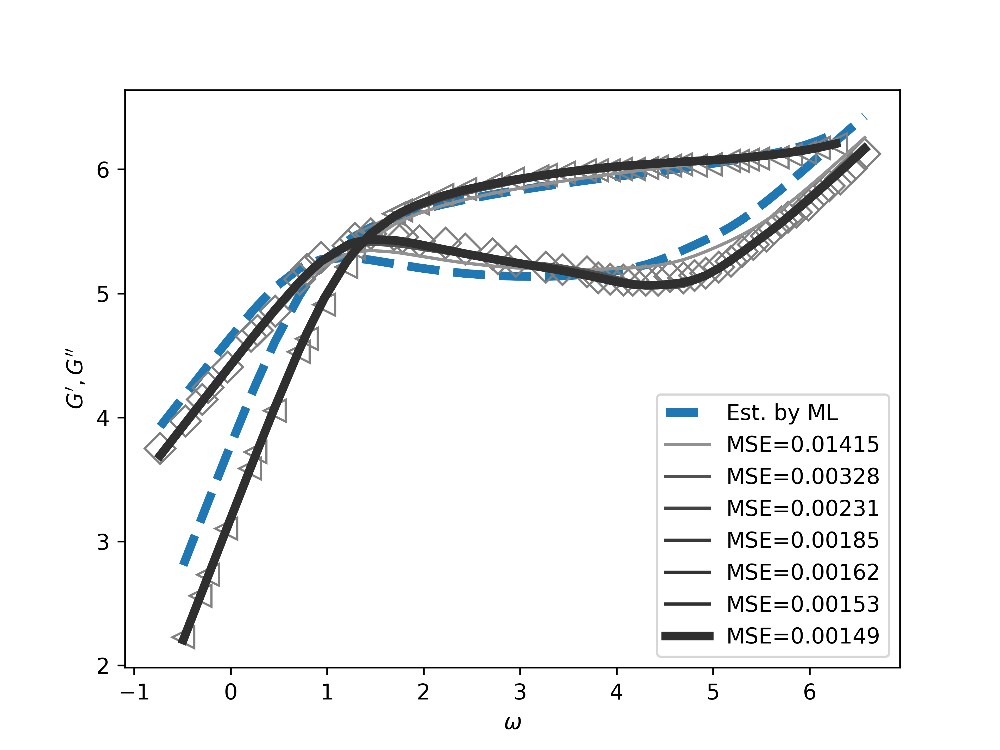
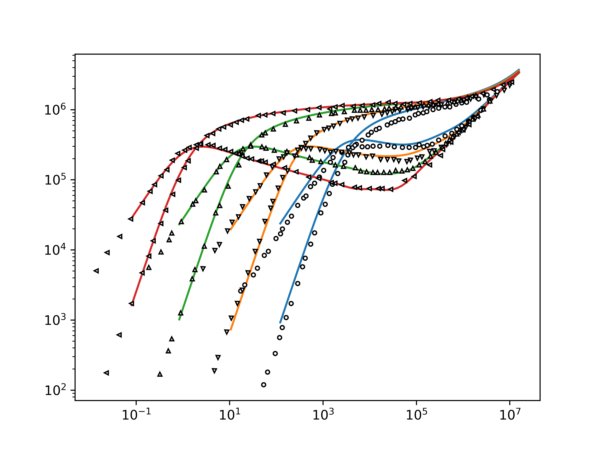

# Modified-Rouse-Model
This project aims to fit the experimental $G'-\omega,G''-\omega$ curves for a given molecular weight and subsequently predict these curves for other molecular weights using a modified Rouse model proposed in our forthcoming publication.

Prerequisites

Before proceeding, ensure that you have installed PyTorch, Python, and all necessary packages on your local machine.

### Data Preparation

You should have a collection of $G'-\omega$ and $G''-\omega$ curves stored in CSV format within the project directory. For example, you might have a file named `data/GP_PB92_2.csv`.

### Calibration Command:

```
python NNCali.py -f GP_PB92_201K.csv -M 201k -o PB92
```

- `GPGPP.csv` is the file containing your G-primes data of $G'-\omega,G''-\omega$ curves.
- `540k` (or `540000`) specifies the molecular weight (M_w) of the polymer being studied.
- `PB92` designates the output filename 'PB92PARA.pkl'. If you don't specify this, the default will be 'GpsModel'.

Upon execution, `NNCali.py` first employs our novel linear modified Rouse model (MRD) to swiftly determine an initial set of parameters that fit your provided data. This process is powered by a neural network. Subsequently, the program minimizes the Mean Squared Error (MSE) between the curves from the model and the experimental data. This refinement process is akin to a Monte-Carlo simulation approach.

At the end, `NNCali.py` produces a calibrated figure, model parameters, and the $M_0$ value. You'll need these outputs for the predictive model, which can generate $G'\sim\omega,G''\sim\omega$ curves for other $M_w$ values.

As shown in Fig. 1, it shows the curves at different optimizing steps with different MSE values.



Figure 1 Storage- and loss- modulus curves at different fine-tuning stages. The dash light blue curve is given directly by neural network.

## Note

Ensure that the domains of $log_{10}\omega$, $log_{10}G'$, and $log_{10}G''$ are all within the range of -10 and 10. If not, you can adjust the domain using the following command after the calibration and preceding prediction commands: `-dw 3 -dG 2`.

### Prediction Command:

```
python NNGps.py -i PB92 -f PBGP92.csv -M 20.7K 44.1k 97k 201k
```

This command uses the model parameters from file 'PB92PARA.pkl' and produces the $G'-\omega,G''-\omega$ curves for $M_w=20.7k, 44.1k, 97k, 201k$. The corresponding experimental curves are taken from 'PBGP92.csv'. The '-f' flag is optional; if not specified, the program will only plot the predicted curves. The predicted curves will be stored in the file 'data/PB92_Theory.CSV' (or 'data/PB92_Theory.pkl').

Alternatively, you can input the model parameters directly:

```
python NNGps.py -i [84.21,7.895,6.6855,0.5676,1.377,0.467,201] -M 20.7K 44.1k 97k 201k
```

In this alternative command, the values 
$M_0,\omega_0,G_0,\nu,\sigma_0,\sigma_1,M_w=[84.21,7.895,6.6855,0.5676,1.377,0.467,201]$ represent the provided model-controlled parameters."



Figure 2 Storage- and loss-modulus curves for different molecular weights obtained by MRD (solid lines) and experiments (symbols), respectively. In this example, the red lines correspond to calibrated storage- and loss-modulus curves.
